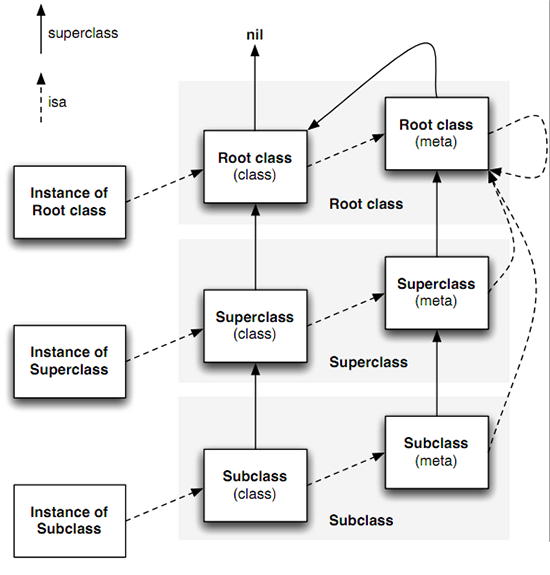

# 概念
</br>
</br>
## 为了方便, 以下 Runtime System 用 RunSys 表示

</br>
</br>
</br>
## OC 运行时
### 运行时就是程序已经被加载到内存中运行起来了
* 仅仅编译时是不够的, 需要运行时系统 (**Runtime system**)
* 底层是一些 C 函数的 API
* 运行时才确定对象的具体类型, 方法具体调用者等等


### 方法本质
* 底层转化成 Runtime, 动态调用

```objc
/* 无参   对象发送消息 ---> Runtime代码 */
[receiver msg]; // 消息发送者 发送  msg 消息, 通俗来讲, 就是 调用 receiver 的 msg 方法
objc_msgSend(receiver,selector); //Runtime 代码 

/* 有参  */
[receiver msg:(id)arg1,(int)arg2,arg3,....];
objc(receiver,selector,arg1,arg2,arg3,....);


```


## Runtime 作用
### OC 与 运行时系统(Runtime System)交互
* 通过 Objective-C 源代码

* 通过 Foundation 框架的 NSObject 类定义的方法
* 通过 Runtime 库 C函数的 直接调用


</br>
</br>
### 通过 Objective - C
* 多数情况下, 我们只需要编写 OC 代码即可, RunSys 自动在幕后搞定一切, 我们编写的代码会在 编译器编译时 将其替换成 Runtime 的代码, 在运行时数据结构和类型

</br>

### 通过 Foundation框架的NSObject类定义的方法
* cocoat 程序中绝大部分类都是继承 NSObject 的子类, 所以都继承了 NSObject 的行为

* NSProxy 并不继承 NSObject , 它和 NSObject 是同级别的, 是一个 抽象类
* NSObject 中有一些 类似 C++ 中的 虚方法(子类要去实现的, 动态调用时, 才确定是哪个子类, 多态)
* 反射 (动态时)
	- \- class 返回对象 此时真实的类型
	- \- isKindeOfClass:   \- isMemberOfClass
	- \- responseToSelector: 检查对象能否响应 方法
	- \- conformsToProtocol: 检查对象是否实现了指定协议的方法
	- \- methodForSelector: 返回指定方法实现的地址


</br>

### 通过 Runtime 库函数直接调用 
* RunSys 是具有公共接口的动态共享库

* 头文件放在 /usr/include/objc目录
* 我们使用时只需要 导入objc/Runtime.h头文件


</br>
## Runtime 相关的数据结构
### SEL
* OC 中叫方法, 其实本质是函数, SEL 就是 OC 中方法的表示
* SEL 对方法名进行包装, 以便找到对应的方法实现
* 数据结构
	- typedef struct objc_selector *SEL
	- 可以看到 它是个映射到方法的 C字符串
	- 获取 SEL
		* OC 编译器命令  @selector()
		* RunSys 的  sel_registerName() 提供的函数
	- **不同类中相同名字的方法所对应的 SEL 是相同的, 由于变量类型的不同, 所以不会导致它们调用方法实现混乱**

</br>

### id
* 指向某个 类的实例(对象) 的指针
	
	```objc
	//数据结构
	typedef struct objc_object *id;
	
	struct objc_object { 
		Class isa;
	 };
	```
	

- 可以看到 objc_object 结构体包含一个 isa 指针, 根据 isa 指针就可以找到对象所属的类

- **isa 指针在代码运行时并不总指向实例对象所属的类型，所以不能依靠它来确定类型，要想确定类型还是需要用对象的 -class 方法**
- KVO 的实现机理就是将被观察对象的 isa 指针指向一个中间类而不是真实类型


### Class
* Class 其实是指向 objc_class(OC类) 结构体的指针
	- typedef struct objc_class *Class

* OC类(objc_class) 的结构

```objc
struct objc_class {
    Class isa  OBJC_ISA_AVAILABILITY;

#if !__OBJC2__
    Class super_class                                        OBJC2_UNAVAILABLE;
    const char *name                                         OBJC2_UNAVAILABLE;
    long version                                             OBJC2_UNAVAILABLE;
    long info                                                OBJC2_UNAVAILABLE;
    long instance_size                                       OBJC2_UNAVAILABLE;
    struct objc_ivar_list *ivars                             OBJC2_UNAVAILABLE;
    struct objc_method_list **methodLists                    OBJC2_UNAVAILABLE;
    struct objc_cache *cache                                 OBJC2_UNAVAILABLE;
    struct objc_protocol_list *protocols                     OBJC2_UNAVAILABLE;
#endif

} OBJC2_UNAVAILABLE;
```

* 从 objc_class 可以看到:一个运行时类中关联了它的父类指针、类名、成员变量、方法、缓存以及附属的协议
* 方法列表 成员变量 协议列表 都是结构体, 存放在 Class 所指向的类中, 分别用结构体指针指向他们


### 参数列表 objc\_ivar_list
```objc
struct objc_ivar_list {
    int ivar_count                                           OBJC2_UNAVAILABLE;
#ifdef __LP64__
    int space                                                OBJC2_UNAVAILABLE;
#endif
    /* variable length structure */
    // 存放单个成员变量的信息
    struct objc_ivar ivar_list[1]                            OBJC2_UNAVAILABLE;
}                                                            OBJC2_UNAVAILABLE;


```


### 方法列表 objc\_method_list
```objc
struct objc_method_list {
    struct objc_method_list *obsolete                        OBJC2_UNAVAILABLE;

    int method_count                                         OBJC2_UNAVAILABLE;
#ifdef __LP64__
    int space                                                OBJC2_UNAVAILABLE;
#endif
    /* variable length structure */
    // 存储单个方法的信息
    struct objc_method method_list[1]                        OBJC2_UNAVAILABLE;
}

```
</br>
#### 对上面 成员和方法列表分析
* 可以修改方法列表(链表操作) 来为类增加方法, Category的分类方法也是在方法列表中, 所以 分类是不能添加属性的
* 在 ojbc_class 中(Class 指向的我们天天定义的类) 也有一个指针 isa, 这个指针指向的也是 ojbc_class在结构体, 其实它指向了 Meta Class 

</br>
### 元类 ( Meta Class)
* 用来处理 类和对象 的关系

* 是 Class指向的 ojbc_class 的类型, 所以 ojbc_class 也是对象, 我们称为类对象
* 存储了 类对象 (ojbc_class) 本身所具备的 元数据
	- 类方法就是存储在 类对象中 他的 isa 指向的 元类中
	- 可以将 类方法 理解为 类对象的 实例方法
* 每个类只有一个类对象, 就是说 我们平时定义的类 其实是唯一的, 这也符合面向对象的思想, 具体的对象可以是多个 类 的实例, 但是类是抽象的 只有一个, 类与类之间可以是继承关系, 也可是非继承关系
* 元类其实也是实例, 他的类型是 Root Meta Class(根元类), 所有元类的 isa 最终指向 根元类
* 元类 具体的结构是什么样的, 其实就是 ojbc_class 的 isa 指向的结构体, 可以看出是 Class, 所以 元类的 结构就是 ojbc_class 的结构


</br>


## 方法调用过程
### 类方法 比如 [Person class]  Person 是类(其实也是类对象)
* 这个消息的接收者是一个类对象(Person)

* Person 就到自己的 类型中(元类)去找 class 方法
* Person 是通过 objc_class 中的 isa 找到自己的类型(元类)的

### 实例方法 [p run]  p是Person的实例
* 这个消息的接收者是 p, 调用的是 - 方法
* p objc_ojbc 结构体中 的 isa 找到他的类型 (Person)
* 在 Person (objc_class) 中去 method_list中查找方法 (其实先去 缓存方法列表中找, 这里先不讨论)


</br>
</br>

### Method (单个方法存储的信息)
* 结构

```objc
typedef struct objc_method *Method;

struct objc_method {
    SEL method_name                                          OBJC2_UNAVAILABLE;
    char *method_types                                       OBJC2_UNAVAILABLE;
    IMP method_imp                                           OBJC2_UNAVAILABLE;
}
```

* objc_method 存储了方法名, 方法类型, 方法实现
	- 名   : SEL
	- 类型 : C 字符串 存储方法的参数类型 返回值类型
	- 实现 : 就是一个函数指针, 指向实现的地址 

</br>

### Ivar (单个成员变量存储的信息)
* Ivar 表示成员亦是的类型

```objc
typedef struct objc_ivar *Ivar;

struct objc_ivar {
    char *ivar_name                                          OBJC2_UNAVAILABLE;
    char *ivar_type                                          OBJC2_UNAVAILABLE;
    int ivar_offset                                          OBJC2_UNAVAILABLE;
#ifdef __LP64__
    int space                                                OBJC2_UNAVAILABLE;
#endif
//ivar_offset 基地址偏移字节


}
```

</br>

### IMP (方法实现的 函数指针)
* 定义在 objc.h
* typedef id (*IMP)(id, SEL, ...)
	- 这就是 函数指针
		* 返回 id (对象)
		* 指针名 IMP
		* 参数 (id, SEL,...)
	- 方法默认会占用前两个参数的位置
		* 第1个: id, 	其实就是 self, 传的是当前方法的调用者
		* 第2个: SEL,	这个对象的 哪个方法
		* 前面说过, 不同实例对象相同的方法, SEL 是一样的, 这里通过 id 和 SEL 就确定了要调用的方法的是唯一的
	

</br>
</br>

### Cache
* 结构

```objc
typedef struct objc_cache *Cache

struct objc_cache {
    unsigned int mask /* total = mask + 1 */                 OBJC2_UNAVAILABLE;
    unsigned int occupied                                    OBJC2_UNAVAILABLE;
    Method buckets[1]                                        OBJC2_UNAVAILABLE;
};
```

* 是进行性能优化的
	- 每当实例对象接收到一个消息时，它不会直接在 isa 指针指向的类的方法列表中遍历查找能够响应的方法，因为每次都要查找效率太低了，而是优先在 Cache 中查找
	- 找到了就调用
	- 找不到就去 method_list 中再查找, 然后将方法缓存在 Cache中, 下次再调用就优先到Cache中查找


</br>
</br>

### Property
* 结构

```objc
typedef struct objc_property *Property;
typedef struct objc_property *objc_property_t;//这个更常用

//可以通过class_copyPropertyList 和 protocol_copyPropertyList 方法获取类和协议中的属性：

objc_property_t *class_copyPropertyList(Class cls, unsigned int *outCount)
objc_property_t *protocol_copyPropertyList(Protocol *proto, unsigned int *outCount)
```
* 上面两个函数返回的是 属性列表(objc_property_t 指针), 不是单个属性

#### 获取属性
```objc
#import <Foundation/Foundation.h>

@interface Dog : NSObject
{
    /** 狗的年龄*/
    int _age;
}
/** 狗的名字*/
@property(nonatomic,copy) NSString *name;

- (void)setAge:(int)age;
- (int)age;

@end


#import "Dog.h"

@implementation Dog
- (void)setAge:(int)age{
    _age = age;
}
- (int)age{
    return _age;
}

@end


#import <Foundation/Foundation.h>

@class Dog;

@interface Person : NSObject
/** 名字*/
@property(nonatomic,copy) NSString *name;

/** 年龄*/
@property(nonatomic,assign) int age;


/** 狗*/
@property(nonatomic,strong) Dog *dog;

@end


int main(int argc, const char * argv[]) {
    @autoreleasepool {
        
        unsigned int counts = 0;
        
        objc_property_t *properties = class_copyPropertyList([Dog class], &counts);
        
        
        for (int i = 0; i < counts; i++) {
            const char *property        = property_getName(properties[i]);
            const char *attributes      = property_getAttributes(properties[i]);
            printf("%s \n %s \n",property,attributes);
            
        }
    }
    return 0;
}


LOG:
	name 
 	T@"NSString",C,N,V_name 
	Program ended with exit code: 0

```

</br>
</br>

## 消息
### 过程 ([p run])
* 先检测这个 selector 是不是要忽略

* 检测这个selector的 target是不是nil, Objc允许我们对一个 nil 对象执行 任何方法不会 Crash, 因为运行时会被忽略掉
* 通过 objc_objc 的 isa 到 类(objc_class)中
* 查找这个类的实现 IMP,先从 cache里找, 找到了就调用
* cache 找不到就到 method_list中找, 找到了就调用 
* 如果没找到, 就 利用 (super_class) 这个指针去 父类中找, 重复 cache 和 method_list的方式, 直到 去 NSObject中
* 如果 NSObject中也没找到, 那么就会开始 runtime 解析了, 后面讲

#### 在消息传递中, 编译器会根据情况在 objc_msgSend, objc_msgSend_stret, objc_msgSendSuper, objc_msgSendSuper_stret中选择一个调用, 如果是用 super 调用, 则会调用 带有 super 的函数, 如果消息返回的是 数据结构不是简单的数据类型时, 会调用名字带有 stret 的函数


</br>

#### 方法中隐含的参数
* objc_msgSend 将消息中所有参数都传递给方法实现，它将传递两个隐藏参数
	- 消息接收者 (self所指向的内容, 当前方法的对象指针)
	- 方法选择器 (_cmd 指向的内容, 当前方法的 SEL 指针)
* 这所以会传两个 隐藏的参数, 是因为 我们并没有发现这两个参数的声明, 它们是在 编译器 将 OC 换成 runtime 时隐含带入的
* 这两个参数, self 更实用, 它是在方法实现中访问消息接收者对象的实例变量的途径

</br>

#### super
* super 关键字接收到消息时, 编译器会创建一个 objc_super 的结构体
	- struct objc_super { id receiver; Class class; };
* objc_mgsSentSuper(self,);


</br>

### 获取方法的地址
* NSObject 类中有一个实例方法：methodForSelector，可以来获取某个方法选择器对应的 IMP

```objc
//函数指针 类似: fun(id objc, SEL selector, BOOL isOK);
void (*setter)(id, SEL, BOOL);
int i;

//用 methodForSelector 获取 target的 setFilled: 的 IMP(函数指针) ,然后强转成 setter 类型
setter = (void (*)(id, SEL, BOOL))[target
    methodForSelector:@selector(setFilled:)];
for ( i = 0 ; i < 1000 ; i++ ){
	//函数指针 调用方法
    setter(targetList[i], @selector(setFilled:), YES);
    }
    
    //当方法被当做函数调用时，两个隐藏参数也必须明确给出，上面的例子调用了1000次函数，你也可以尝试给 target 发送1000次 setFilled: 消息会花多久。虽然可以更高效的调用方法，但是这种做法很少用，除非时需要持续大量重复调用某个方法的情况，才会选择使用以免消息发送泛滥
```

* methodForSelector:方法是由 Runtime 系统提供的，而不是 Objc 自身的特性

</br>
</br>

### 动态方法解析
* 可以动态提供一个方法的实现, 如果使用关键字 @dynamic 在类的实现文件中修饰一个属性, 表明为这个属性动态提供存取方法, 编译器不会默认提供这个属性的 setter 和 getter , 要我们自己提供

```objc
@interface Person : NSObject
/** 年龄属性*/
@property (nonatomic,assgin) int age;

@end


@implementation Person

//表示 动态提供 age 的 setter 和 getter 方法, 
//但是编译 如果 p.age是不会报错的
//只有在运行时才会检查 是否实现了 setter 和 getter , 如果没实现, 就会报错
@dynamic age;

@end

```


</br>
### 补救消息没找到接收者的时机
* 当 RunSys 没在 Cache 和 method_list中找到要执行的方法时, 会调用
	- \+ (BOOL)resolveInstanceMethod:(SEL)sel (或者 resolveClassMethod)
	
	- \- (id)forwardingTargetForSelector:(SEL)sel
	- \- (void)forwardInvocation:(NSInvocation *)anInvocation

</br>

* 这几个方法是按顺序调用的
	- + (BOOL)resolveInstanceMethod:(SEL)sel
	
	```objc
	@implementation Person
	@dynamic age;
		
	void age(Person *self, SEL _cmd, int newAge){
    self->_age = newAge;
    NSLog(@"我是在新的方法中赋值 %d",self->_age);
    
	}

	+ (BOOL)resolveInstanceMethod:(SEL)sel{
    
    	if(sel == sel_registerName("setAge:")){
        	void (*setter)(Person *,SEL,int);
        	setter = age;
        
        	class_addMethod(self, sel, (IMP)setter, "V@:i");
        	return YES;
    	}
    	return [super resolveInstanceMethod:sel];
	}
	@end
	```

* v@:" 表示返回值和参数，这个符号表示的含义见：<a herf="https://developer.apple.com/library/content/documentation/Cocoa/Conceptual/ObjCRuntimeGuide/Articles/ocrtTypeEncodings.html">Type Encoding</a>


* 当上面的方法没有做处理的时候 直接返回	NO, 会来到 - (id)forwardingTargetForSelector:(SEL)aSelector
	- 这个方法是 RunSys 允许 将这个消息 交给其他的对象来处理
	
	```objc
	@implementation Age : NSObject
	{
		int _age;
	}
	- (void)setAge:(int)age{
		_age = age;
    	NSLog(@"我是在 新的类中的方法中  被赋值的 %d",_age);
	}
	
	@end
	
	
	@implementation Person
	
	- (id)forwardingTargetForSelector:(SEL)aSelector{
    	if(aSelector == @selector(setAge:)){
        	return [[Age alloc] init];
    	}
    	return [super forwardingTargetForSelector:aSelector];;
	}

	@end
	```
	
* 当上面的方法返回 self 或者 nil 时, 会来到这个最终的方法
	- - (void)forwardInvocation:(NSInvocation *)anInvocation
	
	```objc
	- (NSMethodSignature *)methodSignatureForSelector:(SEL)aSelector{
    	NSMethodSignature *method = [super methodSignatureForSelector:aSelector];
    	if(method == nil){
        	method = [NSMethodSignature signatureWithObjCTypes:"v@:i"];
    	}
    	return method;
	}

	- (void)forwardInvocation:(NSInvocation *)anInvocation{
    	Age *age = [[Age alloc] init];
    	if([age respondsToSelector:anInvocation.selector]){
        	[anInvocation invokeWithTarget:[[Age alloc] init]];
    	}
    
	}
	
	
	
	int main(int argc, const char * argv[]) {
    	@autoreleasepool {
        	Person *p = [[Person alloc] init];
        	p.age = 10;
        
        
        	return 0;
    	}
	}
	```
* 系统会先来到 methodSignatureForSelector, 如果这个方法返回self 或者 nil,是不会调用forwardInvocation的, 另外, 还要注意 函数的 签名 "v@:i" 我用 大写的 V 是没有回应的

</br>
</br>

## Category动态添加属性
### 属性
- 成员变量 + setter + getter
- 缺一不可


### 给一个实例对象添加一个 关联
```objc
static const void *objc_new_instance = &objc_new_instance;

int main(int argc, const char * argv[]) {
    @autoreleasepool {
        NSObject *objc = [[NSObject alloc] init];
        
        //添加关联
        objc_setAssociatedObject(objc, objc_new_instance, @"liubo", OBJC_ASSOCIATION_COPY_NONATOMIC);
        
        //获取值
        NSLog(@"%@",objc_getAssociatedObject(objc, objc_new_instance));
    }
    return 0;
}
```

</br>
### Category 添加动态添加属性
* OC的用来模块化类的实现的一种语法

* 只能增加方法, 不能增加成员变量
* 即使添加了一个新的属性, 也是声明, 并没有实现
* 利用 runtime 动态添加关联 (变量 + 方法实现)

```objc
#import <objc/runtime.h>
static const void *objc_new_instance = &objc_new_instance;

@interface NSObject (ExtendInstance)

/** 要添加的新属性*/
@property(nonatomic,copy) NSString *instace;
@end

@implementation NSObject(ExtendInstance)

- (void)setInstace:(NSString *)name{
    
    if(0 == name.length) name = @"liubo";
    
    return objc_setAssociatedObject(self, objc_new_instance, name, OBJC_ASSOCIATION_COPY_NONATOMIC);
}

- (NSString *)instace{
    return objc_getAssociatedObject(self, objc_new_instance);
}

@end

int main(int argc, const char * argv[]) {
    @autoreleasepool {
        NSObject *objc = [[NSObject alloc] init];
        objc.instace = @"boge" ;
        NSLog(@"%@",objc.instace);
        
    }
    return 0;
}
```

</br>
</br>
</br>
### runtime 修改已经创建的类 实例的 成员变量的值
``` objc

int main(int argc, const char * argv[]) {
    @autoreleasepool {
        Person *p = [[Person alloc] init];
        p.name = @"liubo";
        unsigned count;
        
        // 先看看有没有 成员变量
        Ivar *vars = class_copyIvarList([p class], &count);
        for (int i = 0; i < count; i++) {
            Ivar var = vars[i];
            //获取成员变量的名字
            const char *name = ivar_getName(var);
            NSLog(@"%s",name);
         }
        
        //取值 设置  注意是 _name 而不是 name
        Ivar var = class_getInstanceVariable([p class], "_name");
        object_setIvar(p, var, @"xtgg");
        NSLog(@"%@",p.name);
    }    
}
```


### 新增成员变量
* class_getInstanceVariable
	- 进入头文件有以下解释
	- 这个函数的调用时机是在  objc\_allocateClassPair 后, objc_registerClassPair 前, 
	- 为一个存在的类添加 新的成员变量是不允许的
	- 添加成员变量的这个类不能是 元类(metaclass)
	- 这个成员变量最小对齐方式在 字节 1<<align
	- 变量依赖于 ivar 的类型 和 cpu架构
	- 对于任何变量的 指针类型, 请通过 log2(sizeof(指针的type))

#### 动态创建类 并添加 成员变量和 方法
```objc
#import <objc/runtime.h>

void setName(id self, SEL _cmd, NSString * name){
    Ivar var = class_getInstanceVariable([self class], "name");
    object_setIvar(self, var, name);
}

NSString * getName(id self, SEL _cmd){
    Ivar var = class_getInstanceVariable([self class],"name");
    return object_getIvar(self, var);
}

int main(int argc, const char * argv[]) {
    @autoreleasepool {
        //因为类也是一个对象, 所以创建类的函数, 是以 objc 开头
    
        // 运行时创建一个类
        /** 
            父类.
            类名;
            ivars分配的字节数, class 和 metaclass 传0
         */
        Class Car = objc_allocateClassPair([NSObject class], "Car", 0);
        
        //添加成员变量   最后一个参数 是参数编码
        class_addIvar(Car, "speed", sizeof(int), sizeof(int), @encode(int));
        class_addIvar(Car, "name", sizeof(NSString *), log2(sizeof(NSString *)), @encode(NSString *));
        
        
        //注册setter到类中
        SEL sel_set = sel_registerName("setName:");
        void (* set)(id,SEL,NSString*) = setName;
        class_addMethod(Car, sel_set, (IMP)set, "v@:@");
        
        
        // 注册 getter 到类中
        SEL sel_get = sel_registerName("name");
        NSString * (* get)(id,SEL) = getName;
        class_addMethod(Car, sel_get, (IMP)get, "@@:");
        
        /* 签名:https://developer.apple.com/library/content/documentation/Cocoa/Conceptual/ObjCRuntimeGuide/Articles/ocrtTypeEncodings.html
            */
        
        
        //注册到runtime
        objc_registerClassPair(Car);
        
        
        
        
        //使用
        NSObject *objc = [[Car alloc] init];  // = 前面还是 NSObject *  = 之后就成了 Car
        NSLog(@"selfClass:%@ superClass:%@",[objc class],[objc superclass]);
        
        
        //设置值
        Ivar var = class_getInstanceVariable([objc class], "name");
        
        object_setIvar(objc, var, @"liubo");        //runtime方式
        
        [objc setValue:@"liubo" forKey:@"name"];    //KVC
        

         /**
            刚刚一直崩溃, 原因是 我在函数  setName 中 调用 getinstace的函数时, 传错了参数 我传的是 objc对象, 而要求传 [objc class]
          
            关于 [objc performSelector withobject: afterDelay:]
                会在当前线程中等待完成后, 再回来调用, 会对 objc 这个对象强引用, 会被加入runloop中,等待回调, 如果是ios的程序, 当对控制器的 view 执行  这个 after后, 会对 view 强引用, 当 控制器 消失后, 这个时候, 刚好回调 performer的话, 如果 处理的代码写在控制器里, 就会 崩溃, 因为 控制器已经死了, 但是view没死, 找不到控制器去执行方法了, 同样的, 如果控制器 调用perform withobjc after ,那么 控制器 pop后, 是不会销毁的, 会出现内存泄露
        */
        //即使加了 after也没用 因为这里没有runloop, 但是如果开启了runloop 就会注册到 runloop的 源中, 等待下一次 runloop的调用, 并且对 objc 强引用, rxtf完后, release 一次
        [objc performSelector:@selector(setName:) withObject:@"boge" afterDelay:2.f];
        
        
        NSLog(@"%@",[objc performSelector:@selector(name)]);
        
        [[NSRunLoop currentRunLoop] run];
    }
    
    return 0;
    
}

```


</br>
</br>
## 方法交换
```objc
#import <objc/objc-runtime.h>
@implementation Car : NSObject
- (void)run{
    NSLog(@"Car 在跑");
}

@end

@implementation Plane : NSObject

- (void)fly{
    NSLog(@"Plane 在飞");
}

@end

int main(int arg, const char* args[]){
    @autoreleasepool {
        Plane *p = [[Plane alloc] init];
        [p fly];
        
        
        Car *c = [[Car alloc] init];
        [c run];
        
        Method fun1 = class_getInstanceMethod([p class], @selector(fly));
        
        Method fun2 = class_getInstanceMethod([c class], @selector(run));
        
        method_exchangeImplementations(fun1, fun2);
        
        [p fly];
        [c run];
        
        
        
        return 0;
    }
}
```


</br>
</br>


# 获取 属性列表, 方法列表, 成员变量列表, 协议列表等等, 去头文件看看就明白了, 这里不多写了, 修改 isa 就是修改 指针的指向
```objc
int main(int arg, const char* args[]){
    @autoreleasepool {
        
        Car *car = [[Car alloc] init];
        //car ---> Car
        
        Plane *plane = [[Plane alloc] init];
        car = plane;
        // car --- > Plane
        
        //isa 本身没变, 只是 对象指针发生了变化
        return 0;
    }
}
```
