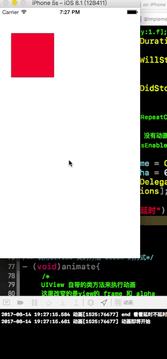
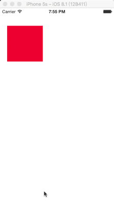
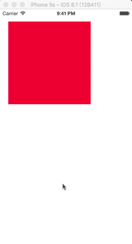

# iOS 中的动画方式
## 调用UIView 类的方法 block 的方式

``` objc
self.animateView = ({
        UIView *view = [[UIView alloc] initWithFrame:CGRectMake(20, 50, 100, 100)];
        view.backgroundColor = [UIColor redColor];
        [self.view addSubview:view];
        view;
    });


/*
     UIView 自带的类方法来执行动画
     这里改变的是view的 frame 和 alpha
 */
    [UIView animateWithDuration:3.f animations:^{
        //
        self.animateView.frame = CGRectMake(200, 300, 40, 100);
        self.animateView.alpha = 0.5;
    } completion:^(BOOL finished) {
        //
        NSLog(@"动画完成");
        self.animateView.alpha = 1.f;
    }];
``` 


## 调用UIView 类的方法 delegate通知方式
```objc
static NSString *animate1 = @"animate1";
- (void)touchesBegan:(NSSet<UITouch *> *)touches withEvent:(UIEvent *)event{
    //动画开启的时间
    [UIView beginAnimations:animate1 context:NULL];
    
    //[UIView setAnimationDelay:1.f];     //延时 多长时间 执行
    [UIView setAnimationDuration:2.f];  // 执行动画过程的时间
    
    [UIView setAnimationWillStartSelector:@selector(startAnimate)];
    
    //动画执行完成后的回调
    [UIView setAnimationDidStopSelector:@selector(stopAnimate)];
    
    //动画执行的 次数
//    [UIView setAnimationRepeatCount:NSIntegerMax];
    
    //能否 动画 如果设置为 NO 表示 没有动画效果
//    [UIView setAnimationsEnabled:NO];
    
    // 表示结束时 缓慢停下来 是个枚举
//    [UIView setAnimationCurve:UIViewAnimationCurveEaseOut];
  
  	//设置动画完成后, 再反向一次动画, 回到初始状态  
//    [UIView setAnimationRepeatAutoreverses:YES]

	//添加动画到视图view上 transition动画样式 cache为YES时高效,但动画执行过程中不能更新UI,为NO时每一帧都可以重新绘制 可以实时更新UI 
//    [UIView setAnimationTransition:transition forView:self.animateView cache:YES]
    
    
    //当YES时：当上一次动画正在执行中，那么当下一个动画开始时，上一次动画的当前状态将成为下一次动画的开始状态
    //当 NO 当上一个动画正在执行中，那么当下一个动画开始时，上一次动画需要先恢复到完成时的状态，然后在开始执行下一次动画 默认的
//    [UIView setAnimationBeginsFromCurrentState:YES];
    
    
    self.animateView.frame = CGRectMake(200, 300, 40, 100);
    self.animateView.alpha = 0.5;
    [UIView setAnimationDelegate:self];
    [UIView commitAnimations];
    
    
    NSLog(@"end 看看延时不延时");
    
}


- (void)startAnimate{
    NSLog(@"动画即将开始");
}
- (void)stopAnimate{
    NSLog(@"动画已经结束");
    animate1 = nil;
    
}
```




## UIView的弹簧效果
```objc
/*
     SpringAnimation动画干净 快速
     
     usingSpringWithDamping 0~1 弹簧效果越小弹簧效果越明显
     
     initialSpringVelocity  初始速度取值较高 并且时间较短时 也会出现弹簧效果
     */
    [UIView animateWithDuration:3.f delay:(NSTimeInterval)1.f usingSpringWithDamping:0.3f initialSpringVelocity:20  options:0 animations:^(void){
        self.animateView.frame = CGRectMake(200, 300, 40, 100);
        self.animateView.alpha = 0.5;
    } completion:^(BOOL finished){
        
    }];

```




## UIView的关键帖动画
```objc
/**
     关键帖动画, 根据官方解释 , 需要在 block 中 调用
      UIView addKeyframeWithRelativeStartTime: relativeDuration: animations:(void (^)(void));
     一次或者多次
      在这个方法的 block 里 给出要做的动画, 如果不调用这个方法, 直接修改 self.father的frame 效果和 之前的几种没区别
     */
    [UIView  animateKeyframesWithDuration:8.f delay:0 options:UIViewKeyframeAnimationOptionLayoutSubviews animations:^{
        
        /** 
            参数1: value:0 ~ 1 之间, 这一帖动画的开始时间 , 它的真正时间 = duration * value
            参数2: value:0 ~ 1 之间, 这上帖动画的结束时间 , 它的真正持续时间 = duration * value
            参数3: 要做的动画
         */
        //开始时间 0  持续 0.1 实际是 8 * 0.1 = 0.8s
        [UIView addKeyframeWithRelativeStartTime:0 relativeDuration:0.1 animations:^{
            self.fatherView.backgroundColor = [UIColor blueColor];
        }];
        
        /// 此时时间点: 0.8
        
        //开始时间是 上次的结束时间 0.8 (就是紧接着 上次的 0.1) 持续时间是 8 * 0,4 = 3.2s
        [UIView addKeyframeWithRelativeStartTime:0.1 relativeDuration:0.4 animations:^{
            self.fatherView.backgroundColor = [UIColor greenColor];
        }];
        
        
        /// 此时的时间点是 3.2 + 0.8 = 4.0;
        
        //开始时间是 上次的结束时间 4.0 (8*0.1+8*0.4) 持续时间 是 8*0.3 = 2.4;
        [UIView addKeyframeWithRelativeStartTime:0.4 relativeDuration:0.3 animations:^{
            self.fatherView.backgroundColor = [UIColor purpleColor];
        }];
        
        
        /// 此时的时间点是 6.4;
        
        
        //开始时间是 上次的结束时间 6.4 (8*0.1+8*0.4+8*0.3) 持续时间 是 8*0.2 = 1.6;
        [UIView addKeyframeWithRelativeStartTime:0.8 relativeDuration:0.2 animations:^{
            self.fatherView.backgroundColor = [UIColor brownColor];
        }];
        
        /// 此时结束的时间是 8
        
        
        // 可以看到 如果是 真正的一帖接上帖的话, 下次开始的时间 == 之前总共持续的时间
        // begin_N = duration * (relative_1 + relative_2 + relative_3 + .... + relative_N-1)
    } completion:^(BOOL finished) {
        
    }];


// 也可以在这里面, 自定义路径, 实现路径动画, 其实底层调用的就是 CoreAnimation的 帖动画
```


## 过度动画
```objc
//过渡动画 当 一个view 的内容需要变化时(frmae, alpha, addsubview, removesuperView时)可以用过渡
    //可以放在外面, 也可以放在 block中
    //[self.fatherView addSubview:self.sonView];
    
    /**
    	参数1 : 指定过渡的容器视图
    	参数2 : 动画的时间 
    	参数3 : 因为是 transion 所以用 UIViewAnimationOptionTransition 开头的枚举
    */
    [UIView transitionWithView:self.fatherView duration:2.f options:UIViewAnimationOptionTransitionCrossDissolve animations:^{
        
        [self.fatherView addSubview:self.sonView];
    } completion:^(BOOL finished) {
        //布尔参数，指示动画是否在调用完成处理程序之前完成。如果动画的持续时间为0，则此块将在下一次运行循环周期的开始执行。如果不为0 则在这次的 runloop中 执行
        finished = NO;
        NSLog(@"先执行我吗?");
    }];
```




```objc
/** 
     这个方法应用到指定视图的转换，这样您就可以对它进行状态更改。您在动画参数中指定的块包含您想要进行的任何状态更改。您可以使用此块来添加、删除、显示或隐藏指定视图的子视图。如果你想把其他可以做成动画变化,你必须包括UIViewAnimationOptionAllowAnimatedContent选项的关键参数。
     
     
     下面的代码为指定的容器视图创建了一个翻转转换。在转换的适当点，将删除一个子视图，并将另一个子视图添加到容器视图中。这使它看起来好像一个新的视图已经被新的子视图所取代，但实际上它只是同样的视图，在一个新的配置中被激活了。
     
     
     在动画中，用户交互被暂时禁用，因为视图是动画的。(在iOS 5之前，整个应用程序都禁用了用户交互。)如果你希望用户能够与观点,包括UIViewAnimationOptionAllowUserInteraction常数参数的选项。
     
     */
    [UIView transitionWithView:self.fatherView duration:3.f options:UIViewAnimationOptionAllowAnimatedContent | UIViewAnimationOptionAllowUserInteraction | UIViewAnimationOptionTransitionFlipFromLeft |
        UIViewAnimationOptionAutoreverse/** 复原一次*/
                    animations:^{
                        [_sonView removeFromSuperview];
                        [_fatherView addSubview:_tmpView];
                    } completion:^(BOOL finished) {
                        NSLog(@"%@ %@",_sonView,_tmpView);
                    }];
```


</br>
</br>

# UIViwe的矩阵变化
## CGAffineTransform (二维矩阵, UIView用)
### CGAffineTransform 
* 结构体 不多讲

```objc
//
struct CGAffineTransform {
  CGFloat a, b, c, d;
  CGFloat tx, ty;
};
```

* 不带 make 的函数, 表示完成形变后, 状态能叠加, 就是还能继续形变
	- CGAffineTransformScale (CGAffinetransform,x,y)   // 缩放
	- CGAffineTransformTranslate(CGAffinetransform,x,y)
	- CGAffineTransformRotate(CGAffinetransform,angle)
	- 参数1 是要做 形变的 view 的 transform 属性

* 带 make 表示只做一次, 不叠加, 不能继续形变
	- CGAffineTransformMakeScale(x,y)
	- CGAffineTransformMakeTranslate(x,y)
	- CGAffineTransformMakeRotate(angle)
	- 没有 transform 参数


</br>
</br>
</br>

# Core Animation
## CALayer
### 概念
* 定义在 QuartzCore框架中, 而QuartzCore不能使用 UIImage, UIColor, 所以CALayer同样不能使用, 它使用 CGImageRef, CGColorRef

* 与UIView相似, 包含图片,文本,背景色,也是视频的画面等等
* 不能交互, 不能响应
* 提供了 某点是否在图层范围内的方法, 但是它并不具备响应的能力
* 是UIView的属性, 由UIView创建并且管理这个图层

###### PS: UIView 之所以能显示, 是因为有 layer, UIView 仅仅是对它的一层封装, 实现了CALayer的delegate, 提供了处理事件交互的具体功能, 还有 UIView 类动画的 高级API(面向对象), 可以说 CALayer 是 UIView的 内部实现细节

### 属性
* CGRect bounds    // 宽高
* CGPoint position     //位置(默认是中心点), 由 anchorPoint决定
* CGPoint anchorPoint //锚点 (x,y 的取值 0 ~ 1, 决定position的含义)
* CGColorRef backgroundColor // 背景色
* CATransform3D transform  	// 形变属性
* CGColorRef boderColor	
* CGFloat	boderWidth
* CGFloat radius	// 圆角半径
* contents 内容

### 基本操作
* 改变 UIView的外观

```objc
	self.imageView.layer.borderColor = [UIColor redColor].CGColor;
   	self.imageView.layer.borderWidth = 3;

    //设置阴影
    self.imageView.layer.shadowColor = [UIColor blueColor].CGColor;
    self.imageView.layer.shadowOpacity = 1;    //阴影的不透明度,默认是0
    self.imageView.layer.shadowOffset = CGSizeMake(-10, 10);
    self.imageView.layer.shadowRadius = 50;    //越大越模糊

    //设置圆角半径
    self.imageView.layer.cornerRadius = 50;
    //超过根层以外的内容就会自动裁剪掉.------阴影也会没有,不能共存
    self.imageView.layer.masksToBounds = YES;

    NSLog(@"%@",self.imageView.layer.sublayers);
    NSLog(@"%@",self.imageView.layer.contents); //imageView的图片存放在layer的contents里面.所以设置layer的圆角半径不会影响到图片

```

###### PS: UIImageView 当中 Image并不是直接添加在层上面的, 这是添加在 layer 当中的 contents 里, 设置层的所有属性它只作用在 层 上面, 对contens里没的东西不起作用, 所以看不到图片有圆角的效果, 想让图片有圆角的话, 设置 masksToBounds为YES, 这样会裁剪掉超出 层 之外的内容

</br>
</br>
</br>

### CATransform 3D (形变 矩阵 给 layer用的 3D矩阵,UIView用的是2D CGAffineTransform)
```objc
旋转,x,y,z 分别代表x,y,z轴.(如UIView的动画都是绕着Z轴变化的)
self.imageView.layer.transform = CATransform3DMakeRotation(M_PI, 0, 1, 0);
平移
self.imageView.layer.transform = CATransform3DScale(self.imageView.layer.transform, 0.5, 0.5, 0);
缩放
self.imageView.layer.transform = CATransform3DTranslate(self.imageView.layer.transform, 50, 50, 0);
```

### 通过KVC 设置layer的形变
```objc
但是CATransform3DMakeRotation它的值,是一个结构体, 所以要把结构转成对象.
NSValue *value = [NSValue valueWithCATransform3D:CATransform3DMakeRotation(M_PI, 1, 0, 0)];
[_imageView.layer setValue:value forKeyPath:@"transform.scale"];
```


### position 和 anchorPoint
* position 用来设置当前 layer 在父控件位置
	- 坐标原点以父控件 左上角 为原点
* anchorPoint 决定 layer 身上 哪一个点 会在 position所指的位置
	- 以当前 layer 左上角为原点
	- 取值 0 ~ 1, 默认是 (0.5,0.5)