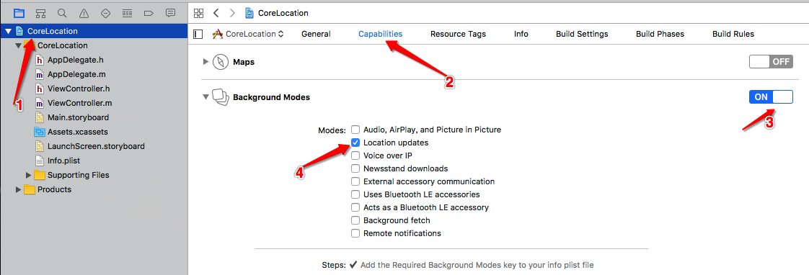

# 地图框架 


### CoreLocation
*  用于地理定位, 地理编码,区域监听等	(**主要注重功能的实现**)

### MapKit
* 用于地图展示, 例如大头针, 路线,覆盖层展示等	(**着重界面展示**)  

### 2个专业的术语
* LBS: 		Location Based Service
* SoLoMo:		Social Local Mobile(**索罗门**)
	
	```
	scocial:   社交化	(社交类APP)
	lcoal:     本地化	(LBS)
	mobile:    移动化	(3/4/5G网,移动APP)
	```

### 使用CoreLocation的基本步骤
* 导入框架(Xcode5.0 之后可以省略 **\<CLocaiton.framework>**)
* 导入主头文件	(**\<CLocation/CLocation.h>**)
* 使用 CLLocationmanager对象来做用户定位

###### PS: CoreLocation框架中所有的数据类型都是以 CL 开头(有过开发经验的都晓得)
</br></br></br>


## iOS定位分类
### iOS8之前的定位
* 导入框架,导入头文件(Xcode6 之后不用手动导入)
	- \<CoreLocation/CoreLocation.h\>
* 配置info.plist
	- iOS在6的时候,开始增强对用户的隐私保护在访问用户的位置,相册等等时会出现弹框, 提示用户请求授权,为了让APP授权成功的机率增大,一般在 info.plist中配置  **Privacy - Location When In Use Usage Description** 这样在弹框的时候会给出这个 **key** 的 **String** 值
	

* 创建全局的位置管理者
	- 位置管理者一定要是全局的
		```
		self->_mgr = [[CLLocationManager alloc] init];
		```
* 设置定位属性
```
// 每隔100米定位一次
self.mgr.distanceFilter = 100 ;
    
// 定位精确度 (精确度越高, 越耗电 这里我给出的是 千米)
self.mgr.desiredAccuracy = kCLLocationAccuracyKilometer;
```
* 绑定代理(遵守协议)
	```
	// 绑定代理, 能接收数据
    	_mgr.delegate = self;
	```
* 开启定位
	```
	[_mgr startUpdatingLocation];
	```

* 监听回调
	
```
/** 定位后会不断调用, 所以直接停掉, 当然开发中必须每隔多远再次定位, 所以要设置 mgr的属性 */
- (void)locationManager:(CLLocationManager *)manager didUpdateLocations:(NSArray<CLLocation *> *)locations{
    NSLog(@"%@",locations);
}
```
* 如果要支持后台定位, 则要 打开后台模式
	- 在info.plist中配置
		


### iOS8之后的定位
* 导入框架,导入头文件(Xcode6 之后不用手动导入)
	- \<CoreLocation/CoreLocation.h\>
</br></br>
* 配置info.plist
	- 同 iOS8之前的一样的配置
		
</br></br>
* 创建全局的位置管理者
	- 位置管理者一定要是全局的
		
		```objc
		self->_mgr = [[CLLocationManager alloc] init];
		```
</br></br>
* 绑定代理(遵守协议)
	
	```objc
	// 绑定代理, 能接收数据
    	_mgr.delegate = self;
	```
</br></br>
* 设置定位属性
	
```objc
// 每隔100米定位一次
self.mgr.distanceFilter = 100 ;
    
// 定位精确度 (精确度越高, 越耗电 这里我给出的是 千米)
self.mgr.desiredAccuracy = kCLLocationAccuracyKilometer;
```
</br></br>
* 但是 iOS8 之后, 苹果继续加强了用户的隐私保护, 程序员必须自己用 代码提示用户授权, 所以iOS8 之后提供了两个方法
	- \- (void)requestWhenInUseAuthorization
		
```objc
//这个方法是程序员手动请求用户授权的
[self.mgr requestWhenInUseAuthorization];
			
```
		###### ps:只能在前台定位, 不能在后台定位, 如果要启用后台定位的话要打开后台模式,但是这种情况下,后台定位时,在屏幕的上状态栏会出现蓝色的 提示框, 提示用户当前正在后台定位
		
	</br>
	- - (void)requestAlwaysAuthorization
		
		```objc
		[self.mgr requestWhenInUseAuthorization];
		```
		###### PS:调用这个方法就不需要配置后台模式了, 但是info.plist中一定配置 **NSLocationAlwaysUsageDescription**, 成功后台定位时,不会出现上面那种情况(屏幕上方有蓝条提示)
		
</br></br>
* 开启定位
	
	```
	[_mgr startUpdatingLocation];
	```
</br></br>

* 监听回调
	
	```objc
	/** 定位后会不断调用, 所以直接停掉, 当然开发中必须每隔多远再次定位, 所以要设置 mgr的属性 */
	- (void)locationManager:(CLLocationManager *)manager didUpdateLocations:(NSArray<CLLocation *> *)locations{
    	NSLog(@"%@",locations);
	}
	
	```
	
	```objc
	/** 用户授权状态 */
	- (void)locationManager:(CLLocationManager *)manager didChangeAuthorizationStatus:(CLAuthorizationStatus)status{
    	switch (status) {
        	case kCLAuthorizationStatusDenied:
        	{
            		if([CLLocationManager locationServicesEnabled]){
                	NSLog(@"被拒");
            	}else{
                	NSLog(@"定位没打开");
            	}
        	}
            break;
        case kCLAuthorizationStatusNotDetermined:
            NSLog(@"状态没有被决定");;
            break;
        case kCLAuthorizationStatusAuthorizedAlways:
            NSLog(@"前后台");
            break;
        case kCLAuthorizationStatusAuthorizedWhenInUse:
            NSLog(@"前台");;
            break;
        default:
            break;
    }
}
	```
</br></br>


# iOS地图开发系统适配这样写
```objc 
//这个方法是手动获取用户当前的授权状态, 而代理方法是 被动接收到了用户状态发行改变的时候调用,是不一样的
if([CLLocationManager locationServicesEnabled] &&
       [CLLocationManager authorizationStatus] != kCLAuthorizationStatusDenied &&
       [CLLocationManager authorizationStatus] != kCLAuthorizationStatusNotDetermined){
        NSLog(@"网络状态不可用");
    }else if([CLLocationManager authorizationStatus] == kCLAuthorizationStatusDenied){
        NSLog(@"没有被用户授权");
    }else {
        NSLog(@"用户没有授权");
        //懒加载
        [self mgr];
    }
 }
 
 - (CLLocationManager *)mgr{
    if (!_mgr){
        //1 创建位置管理者 并绑定代理
        _mgr = [[CLLocationManager alloc] init];
        
        _mgr.delegate = self;
        
        //适配 ios 8 以上
        if([self.mgr respondsToSelector:@selector(requestWhenInUseAuthorization)]){
            [self.mgr requestWhenInUseAuthorization];
        }
         
        //适配 ios 9 9.0 要想在前台模式下进入后台也能调用,必须设置这个属性为 YES
        if([self.mgr respondsToSelector:@selector(allowsBackgroundLocationUpdates)]){
        	  //一定要 配置后台模式
            self.mgr.allowsBackgroundLocationUpdates = YES;
        }
        
        //PS: 当+ authorizationStatus != kCLAuthorizationStatusNotDetermined,(即 一般在第一次调用后)这个方法什么也不做。 也就是说, 这个方法只要用户授权状态改变, 以后就不会出现授权弹框了
        //但是用户的状态如果是kCLAuthorizationStatusAuthorizedWhenInUse,那么调用[self.mgr requestWhenInUseAuthorization] 和 [self.mgr requestAlwaysAuthorization]
        //第一次会先弹 when 这个, 如果重新打开应用, 还是会继续调用 always 来弹框,让用户授权 always的优先级要大一些
        
        
        
        //3 设置定位的属性
        //self.mgr.distanceFilter = 100;  //每隔 100m 定位一次
        self.mgr.desiredAccuracy = kCLLocationAccuracyBest;  // 定位精度
        
        
        //开启定位
        [self.mgr startUpdatingLocation];
        /*
        ios 9 之后出来的方法
            会逐步比 精度低的 开始 往 精度高的 定位, 如果定位到了最准确的位置, 那么直接在代理中返回定位的位置,如果在有效时候内没有定位到,那么就是定位错误
         这个方法不能与   startUpdatingLocation   和    allowDeferredLocationUpdates 同时用, 而且必须实现 代理的 locationManager:didFailWithError: 去响应定位失败
         */
        //[self.mgr requestLocation];
        
        
        // 5 5s 的8.1 死都不会回调位置 看来是不是要用真机
        // 6 会调用
        // 如果不调用, 这个时候把模拟器 reset 一下 
    }
    return self->_mgr;
}
 
 
 #prama mark -- <代理回调>
 /** 定位后会不断调用, 所以直接停掉, 当然开发中必须每隔多远再次定位, 所以要设置 mgr的属性 */
- (void)locationManager:(CLLocationManager *)manager didUpdateLocations:(NSArray<CLLocation *> *)locations{
    CLLocation *location = [locations lastObject];
    /*
     CLLocationCoordinate2D 经纬度
     speed 速度
     altitude 海拨
     course 方向
     
     */
}

/** 用户授权状态发生改变时会调用 */
- (void)locationManager:(CLLocationManager *)manager didChangeAuthorizationStatus:(CLAuthorizationStatus)status{
    switch (status) {
        case kCLAuthorizationStatusDenied:
        {
            if([CLLocationManager locationServicesEnabled]){
                NSLog(@"被拒");
            }else{
                NSLog(@"定位没打开");
            }
        }
            break;
        case kCLAuthorizationStatusNotDetermined:
            NSLog(@"状态没有被决定");;
            break;
        case kCLAuthorizationStatusAuthorizedAlways:
            NSLog(@"前后台");
            break;
        case kCLAuthorizationStatusAuthorizedWhenInUse:
            NSLog(@"前台");;
            break;
        default:
            break;
    }
}

```

