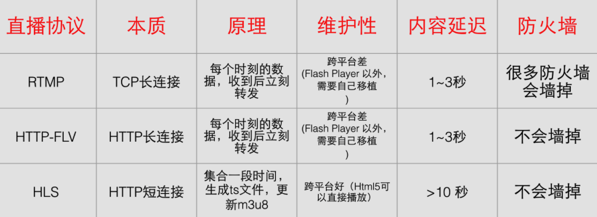
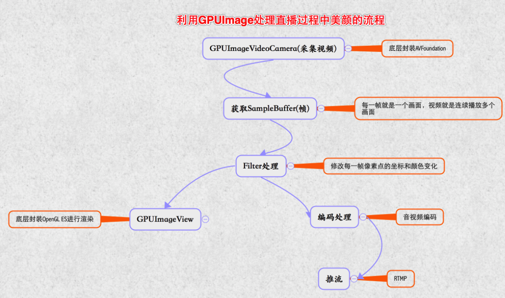

## 项目
###艾视直播
* 在局域网内，要通过一台主机和其他主机进行通信，需知道对方IP
* 但有时候, 很多情况下, 在一个局域网内, 都是通过 DHCP 动态分配 IP的, 要知道对方的IP也是比较麻烦的, 毕竟对方的 IP 是动态分配的, 随时可能会变
*  mDNS就是来解决这个问题的

#### mDNS
* 通过一个约定的端口号 (5353)
* 每个进入局域网的主机, 如果开启了 mDNS, 会向局域网内所有的主机广播 自己的 IP, 并且其他开启了mDNS服务的主机会收到这个广播, 就可以连接上发送广播的主机了
	- 比如，A主机进入局域网，开启了的mDNS服务，并向的mDNS服务注册一下信息：我提供FTP服务，我的IP是192.168.1.101，端口是21.当乙主机进入局域网，并向乙主机的的mDNS服务请求，我要找局域网内的FTP服务器，B主机的的mDNS就会去局域网内向其他的的mDNS询问，并且最终告诉你，有一个IP地址为192.168.1.101，端口号是21的主机，也就是甲主机提供FTP服务，所以B主机就知道了一个主机的IP地址和端口号了。


#### 苹果的 mDNS 框架 Bonjour


### **Bonjour**的使用
#### 服务器注册服务　
```objc
//首先我们需要使用到iOS SDK里的NSNetService类
@property(strong,nonatomic)NSNetService*netService;
//初始化服务，指定服务的域，类型，名称和端口
   _netService = [[NSNetService alloc] initWithDomain:@"local." type:@"_http._tcp." name:@"DamonWebServer" port:5222];
   
   
 
 
//指定代理
[_netServicesetDelegate:self];
//发布注册服务
[_netService publish];


//NSNetServiceDelegate代理协议相关代理方法  按需求使用
@protocolNSNetServiceBrowserDelegate <NSObject>
@optional
 
/* 
在实例开始搜索之前发送给NSNetServiceBrowser实例的委托。如果实例无法开始搜索，则委托将不会收到此消息。相反,委托将收到-netServiceBrowser:didNotSearch:消息
*/
- (void)netServiceBrowserWillSearch:(NSNetServiceBrowser*)aNetServiceBrowser;
 
/* 
当代理上一个搜索停止时,会回调这个代理方法
*/
- (void)netServiceBrowserDidStopSearch:(NSNetServiceBrowser*)aNetServiceBrowser;
 
/* 
当搜索域或服务发生错误时，发送到NSNetServiceBrowser实例的委托。错误字典将包含两个代表错误域和代码的键/值对(参见上面的NSNetServicesError枚举错误代码常量)。在搜索成功启动后，可能出现错误。
*/
- (void)netServiceBrowser:(NSNetServiceBrowser*)aNetServiceBrowser didNotSearch:(NSDictionary*)errorDict;
 
/* 
发送到NSNetServiceBrowser实例的每个域的委托。如果有更多的域名，我们将会选择“是”。如果出于某些原因，处理发现的域需要大量的处理，积累域直到moreComing不是，然后以批量方式进行处理可能是可取的。
*/
- (void)netServiceBrowser:(NSNetServiceBrowser*)aNetServiceBrowser didFindDomain:(NSString*)domainString moreComing:(BOOL)moreComing;
 
/*
发送到NSNetServiceBrowser实例的委托，为每个服务发现。如果有更多的服务，我将会是。如果出于某些原因，处理发现的服务需要大量的处理，积累服务直到moreComing没有，然后以批量方式进行处理可能是可取的。
*/
- (void)netServiceBrowser:(NSNetServiceBrowser*)aNetServiceBrowser didFindService:(NSNetService*)aNetService moreComing:(BOOL)moreComing;
 
/* 
当先前发现的域不再可用时，发送到NSNetServiceBrowser实例的委托。
*/
- (void)netServiceBrowser:(NSNetServiceBrowser*)aNetServiceBrowser didRemoveDomain:(NSString*)domainString moreComing:(BOOL)moreComing;
 
/* 
当一个以前发现的服务不再发布时，发送给NSNetServiceBrowser实例的委托。
*/
- (void)netServiceBrowser:(NSNetServiceBrowser*)aNetServiceBrowser didRemoveService:(NSNetService*)aNetService moreComing:(BOOL)moreComing;
 
   
   
```

#### 客户端发现本地服务
```objc

//客户端主要使用的是iOS SDK里的NSNetServiceBrowser
@property(strong,nonatomic)NSNetServiceBrowser*serverBrowser;
@property(strong,nonatomic)NSMutableArray*servers;
//NSNetService在客户端用于解析
@property(strong,nonatomic)NSNetService*netserver;
 
//初始化NSNetServiceBrowser
_serverBrowser= [[NSNetServiceBrowseralloc]init];
//指定代理
_serverBrowser.delegate = self;
_servers = [NSMutableArrayarray];
//查找服务
接着使用NSNetServiceBrowser实例的searchForServicesOfType方法查找服务，方法中可以指定需要查找的服务类型和查找的域
[_serverBrowsersearchForServicesOfType:@"_http._tcp."inDomain:@"local."];


NSNetServiceBrowserDelegate代理协议相关代理方法

注：客户端可以通过NSNetService解析服务，解析成功后，可以获得通讯的数据细节，如：IP地址、端口等信息。 
-//下面是几个常用的代理方法

//即将解析服务，
- (void)netServiceWillResolve:(NSNetService *)netService {
    
    NSLog(@"netServiceWillResolve");
    
}
//解析服务成功
- (void)netServiceDidResolveAddress:(NSNetService *)netService {
    
    NSLog(@"service ip:%@,------port:%d",netService.addresses,netService.port);
        
}
 //解析服务失败，解析出错
- (void)netService:(NSNetService *)netService didNotResolve:(NSDictionary *)errorDict {
    
    NSLog(@"didNotResolve: %@",errorDict);
    
} 
 
//已发现服务
- (void)netServiceBrowser:(NSNetServiceBrowser *)netServiceBrowser didFindService:(NSNetService *)netService moreComing:(BOOL)moreServicesComing
{
    
    NSLog(@"didFindService");
    _netserver = netService;
    _netserver.delegate = self;
    //设置解析超时时间
    [_netserverresolveWithTimeout:5.0];
 
}
```


### Socket发送指令实现从机顶盒获取节目直播流数据


## 直播原理
### 三个角色
* 主播
* 服务器
* 观众


## 直播细节
### 主播
#### 主要任务是推流
* 采集数据
	- 视频
	- 音频
* 视频美化(各种滤镜)
* 视频,音频编码(各种压缩)
* 推流(推给服务器)
* 用到的框架
	- AVFoundation  采集数据
	- GPUImage  滤镜美颜
	- FFmpeg  音频压缩
	- X264    视频压缩
	- libremp 推流(rtmp协议)

### 服务器(支持流媒体)
#### 主要任务是 处理后分发 (我们 客户端不怎么关心)
* 数据分发(CDN)
* 鉴黄
* 截屏
* 录制视频
* 实时转码
* 用到的服务器
	- SNS
	- BMS
	- nginx


### 观众(客户端)
#### 拉流
* 从FLV TS分离 音频视频数据
* 音视频解码
* 播放
* 聊天互动
* 用到的框架
	- ijkplayer  播放
	- FFmpeg  视频解码
	- VideoToolbox 视频硬解码
	- AudioToolbox 音频硬解码

###### PS: 我们的任务是 主播(数据采集处理) 和 观众(客户端)

### 整个流程架构
* 利用 AVFoundation获取 输入输出设备采集数据
* 用 GPUImage 对视频数据 滤镜美颜
* 用 FFmpeg 压缩音频 
* 用X264 压缩视频
* 用 libremp 获取服务器推流地址, 推流到服务器

* 服务器对数据进行各种处理 省....

* 用规定的协议(RTMP HLS FLV) 通过 拉流的 url 获取服务器分发的数据
* 用ijkplayer解码 数据, 或者用 VideoToolbox, AudioToolbox对视频音频硬解码
* 用ijkplayer播放
* 用即时通讯(socket, 三方的框架)在线互动


## 技术难点
### 主播
</br>
#### 视频,音频的采集
* 视频采集
	- 摄像头 (CCD CMOS)

* 音频采集			
	- 麦克风 (拾音器)
		

* ios音视频采集框架
	- 导入AVFoundation
	- 从captureSession会话的回调中获取音频,视频数据

</br>
#### 视频处理
- 美颜
- 水印
- 使用 GPUImage美颜,水印

</br>	
#### 视频,音频的压缩
* 硬编码
	- 视频: VideoToolbox框架
	- 音频: AudioToolbox框架
* 软编码
	- 视频压缩
		* 编码成 MPEG,H.264
		* x264框架 把视频原数据 YUV/RGB 编码成 H.264 
	- 音频压缩
		* 编码成 mp3 AAC
		* fdk_aac 把音频数据 PCM 转成 AAC

</br>
#### 推流 (即将采集到的音频,视频数据通过  流媒体协议  发送到流媒体服务器)
* muxing: 将音频和视频包装成 FLV 或者 TS
* 推流技术
	- 流媒体协议 RTMP RTSP HLS FLV
	- 视频封装格式 TS FLV
	- 音频封装格式	mp3 AAC
* 推流方案
	- librtmp 把数据推送到流媒体服务器 (基于 RTMP 协议)
	- HLS 直接用HPPT协议上传


</br>
</br>
</br>

### 观众 (客户端)
#### PS: 首先流媒体服务器处理数据
* 数据分发 (CDN)
* 截屏
* 录制
* 实时转码

#### 拉流 (从流体获取 音频,视频的数据)
* 流媒体协议
	- RTMP
	- RTSP
	- HLS
	- FLV
* 视频,音频解码 (demuxing解封装 把 FLV TS 文件分离出来音频和视频)
* 硬解码
	- 视频硬解码 VideoToolbox
	- 音频硬解码 AudieToolbox
* 音频解码
	- 视频软解码 x264
	- 音频软解码 fdk_aac

### 播放
* ijkplayer (开源的很强大的播放器)

#### 聊天互动 (IM 即时通讯)
* 聊天室功能
* 框架 (腾讯云SDK, 融云SDK)


## 用到的框架基础
### 数据采集 (AVFoundation)
* AVFoudation是用来播放和创建裡的视听媒体数据的框架, 提供了 OC 接口来操作这些视听数据
* 采样格式
	- 视频 : YUV 或者 RGB
	- 音频 : PCM
* 采样后 原数据很大, 需要压缩

### 视频处理 (美颜, 水印)
* 视频最终是通过 GPU, 一帖一帖渲染到屏幕上的
* 用 OpenGL ES, 对视频进行各种加工
* 现在的各种美颜和视频添加特效都是利用 GPUImage 这个框架实现的

### 编码框架
*  FFmpeg 是跨平台的开源的, 功能强大
*  libswresample : 对音频采样, rematrixing以及转换采样格式等
*  libavcodec : 提供了一个通用的编解码框架,包含了许多视频,音频,字幕流 等编码/解码器
*  libavformat : 用于对视频进行封装/解封装
*  libpostproc : 用于进行视频的一些后期处理
*  libswscale : 用于视频图像缩放,颜色空间转换等
*  libavfilter : 提供滤镜功能
*  x264 : 把视频原数据YUV编码压缩成  H.264
*  VideoToolbox : 苹果自带的 视频硬解码和硬编码  ios8后
*  AudioToolbox : 苹果自带的 音频硬解码和硬编码

### 视频编码技术 (就是用以上的框架来压缩视频,下面是压缩的目的) 
* 压缩编码标准 对视频进行压缩(视频编码)或者解压缩（视频解码）的编码技术,比如MPEG，H.264,这些视频编码技术是压缩编码视频的
* 作用 : 将视频像素数据压缩成为视频码流，从而降低视频的数据量。如果视频不经过压缩编码的话，体积通常是非常大的，一部电影可能就要上百G的空间。

### 音频编码技术
* AAC mp3 : 这些属于音频编码技术,压缩音频用

### 视频封装格式
* TS : 一种流媒体封装格式，流媒体封装有一个好处，就是不需要加载索引再播放，大大减少了首次载入的延迟，如果片子比较长，mp4文件的索引相当大，影响用户体验
	- 两个TS片段可以无缝拼接，播放器能连续播放
* FLV : 一种流媒体封装格式,由于它形成的文件极小、加载速度极快，使得网络观看视频文件成为可能,因此FLV格式成为了当今主流视频格式


## 推流
### 数据传输框架
* librtmp : 用来传输RTMP协议格式的数据

### 流媒体传输协议
* RTMP : 实时消息传输协议,Adobe Systems公司为Flash播放器和服务器之间音频、视频和数据传输开发的开放协议，因为是开放协议所以都可以使用了
	- 用于对象,视频,音频的传输
	- 这个协议是建立在 TCP 或者  轮询 HPPT协议之上
	- RTMP协议就像一个用来装数据包的容器，这些数据可以是FLV中的视音频数据。一个单一的连接可以通过不同的通道传输多路网络流，这些通道中的包都是按照固定大小的包传输的
	- chunk : 消息包


## 流媒体服务器
### 服务器的选择
* SRS：一款国人开发的优秀开源流媒体服务器系统
* BMS:也是一款流媒体服务器系统，但不开源，是SRS的商业版，比SRS功能更多
* nginx:免费开源web服务器，常用来配置流媒体服务器。

### 数据分发
* CDN：(Content Delivery Network)，即内容分发网络,将网站的内容发布到最接近用户的网络”边缘”，使用户可以就近取得所需的内容，解决 Internet网络拥挤的状况，提高用户访问网站的响应速度
* 回源 : 当有用户访问某一个URL的时候，如果被解析到的那个CDN节点没有缓存响应的内容，或者是缓存已经到期，就会回源站去获取搜索。如果没有人访问，那么CDN节点不会主动去源站拿.
* 带宽 固定的时间可传输的数据总量
* 负载均衡 : 由多台服务器以对称的方式组成一个服务器集合，每台服务器都具有等价的地位，都可以单独对外提供服务而无须其他服务器的辅助.


## 拉流
### 直播协议的选择
* 即时性要求较高 或有 互动需求的可以采用 RTMP RTSP
* 对于有回放或跨平台需求的 推荐 HLS

### 协议对比


* HLS 由Apple公司定义的用于实时流传输的协议,HLS基于HTTP协议实现，传输内容包括两部分，一是M3U8描述文件，二是TS媒体文件。可实现流媒体的直播和点播，主要应用在iOS系统
	- HLS是以点播的技术方式来实现直播
	- HLS是自适应码率流播，客户端会根据网络状况自动选择不同码率的视频流，条件允许的情况下使用高码率，网络繁忙的时候使用低码率，并且自动在二者间随意切换。这对移动设备网络状况不稳定的情况下保障流畅播放非常有帮助。
	- 实现方法是服务器端提供多码率视频流，并且在列表文件中注明，播放器根据播放进度和下载速度自动调整。

* HLS与RTMP对比:HLS主要是延时比较大，RTMP主要优势在于延时低
	- HLS协议的小切片方式会生成大量的文件，存储或处理这些文件会造成大量资源浪费
	- 相比使用RTSP协议的好处在于，一旦切分完成，之后的分发过程完全不需要额外使用任何专门软件，普通的网络服务器即可，大大降低了CDN边缘服务器的配置要求，可以使用任何现成的CDN,而一般服务器很少支持RTSP。

* HTTP-FLV:基于HTTP协议流式的传输媒体内容
	- 相对于RTMP，HTTP更简单和广为人知，内容延迟同样可以做到1~3秒，打开速度更快，因为HTTP本身没有复杂的状态交互。所以从延迟角度来看，HTTP-FLV要优于RTMP。
	
* RTSP:实时流传输协议,定义了一对多应用程序如何有效地通过IP网络传送多媒体数据
* RTP:实时传输协议,RTP是建立在UDP协议上的，常与RTCP一起使用，其本身并没有提供按时发送机制或其它服务质量（QoS）保证，它依赖于低层服务去实现这一过程
* RTCP:RTP的配套协议,主要功能是为RTP所提供的服务质量（QoS）提供反馈，收集相关媒体连接的统计信息，例如传输字节数，传输分组数，丢失分组数，单向和双向网络延迟等等。


## 解码
### 解封装
* demuxing（分离）：从视频流、音频流，字幕流合成的文件(容器格式（FLV，TS）)中， 分解出视频、音频或字幕，各自进行解码

### 音频编码框架
* fdk_aac:音频编码解码框架，PCM音频数据和AAC音频数据互转
* 解码介绍 
	- 优点 : 兼容好
	- 缺点 : 加大CPU负担，耗电增加、没有硬解码流畅，解码速度相对慢


## 播放
### ijkplayer
* 基于FFmpeg的开源Android/iOS视频播放器
* 易于集成
* 编译配置可裁剪，方便控制安装包大小
* 支持硬件加速解码，更加省电
* 简单易用，指定拉流URL，自动解码播放


## 聊天互动
### IM
* IM:(InstantMessaging)即时通讯:是一个实时通信系统，允许两人或多人使用网络实时的传递文字消息、文件、语音与视频交流.
* 腾讯云：腾讯提供的即时通讯SDK，可作为直播的聊天室
* 融云：一个比较常用的即时通讯SDK，可作为直播的聊天室


## 快速开发一个完整的 iOS 直播app
### 七牛云
* 七牛直播云是专为直播平台打造的全球化直播流服务和一站式实现SDK端到端直播场景的企业级直播云服务平台
### 网易云
* 基于专业的跨平台视频编解码技术和大规模视频内容分发网络，提供稳定流畅、低延时、高并发的实时音视频服务，可将视频直播无缝对接到自身App


</br>
</br>
</br>
</br>
</br>


# 播放
## 集成 ijkplayer
### 略....

## 使用 ijkplayer
###### PS:只要有直播地址，就能直播

### 抓取数据
```objc
- (void)loadData
{
    // 映客数据url
    NSString *urlStr = @"http://116.211.167.106/api/live/aggregation?uid=133825214&interest=1";

    // 请求数据
    AFHTTPSessionManager *mgr = [AFHTTPSessionManager manager];
    mgr.responseSerializer = [AFJSONResponseSerializer serializer];
    mgr.responseSerializer.acceptableContentTypes = [NSSet setWithObjects:@"text/plain", nil];
    [mgr GET:urlStr parameters:nil progress:nil success:^(NSURLSessionDataTask * _Nonnull task, NSDictionary * _Nullable responseObject) {

        _lives = [YZLiveItem mj_objectArrayWithKeyValuesArray:responseObject[@"lives"]];

        [_tableView reloadData];

    } failure:^(NSURLSessionDataTask * _Nullable task, NSError * _Nonnull error) {

        NSLog(@"%@",error);

    }];
}
```

### 获取拉流 url ,直播
* IJKFFMoviePlayerController：用来做直播的类

```objc
- (void)viewDidLoad {
    [super viewDidLoad];

    self.view.backgroundColor = [UIColor whiteColor];

    // 设置直播占位图片
    NSURL *imageUrl = [NSURL URLWithString:[NSString stringWithFormat:@"http://img.meelive.cn/%@",_live.creator.portrait]];
    [self.imageView sd_setImageWithURL:imageUrl placeholderImage:nil];

    // 拉流地址
    NSURL *url = [NSURL URLWithString:_live.stream_addr];

    // 创建IJKFFMoviePlayerController：专门用来直播，传入拉流地址就好了
    IJKFFMoviePlayerController *playerVc = [[IJKFFMoviePlayerController alloc] initWithContentURL:url withOptions:nil];

    // 准备播放
    [playerVc prepareToPlay];

    // 强引用，反正被销毁
    _player = playerVc;

    playerVc.view.frame = [UIScreen mainScreen].bounds;

    [self.view insertSubview:playerVc.view atIndex:1];

}
```

### 结束播放
* 界面不播放，一定要记得结束播放，否则会报内存溢出

```objc
- (void)viewWillDisappear:(BOOL)animated
{
    [super viewWillDisappear:animated];

    // 界面消失，一定要记得停止播放
    [_player pause];
    [_player stop];
}
```

</br>
</br>
</br>
</br>
</br>


# 数据采样
## 基本知识
### AVFoundation
* 音视频数据采集需要用AVFoundation框架

* AVCaptureDevice 硬件设备，包括麦克风、摄像头，通过该对象可以设置物理设备的一些属性（例如相机聚焦、白平衡等）

* AVCaptureDeviceInput 硬件输入对象，可以根据AVCaptureDevice创建对应的

* AVCaptureDeviceInput对象，用于管理硬件输入数据

* AVCaptureOutput 硬件输出对象，用于接收各类输出数据，通常使用对应的子类AVCaptureAudioDataOutput（声音数据输出对象）、AVCaptureVideoDataOutput（视频数据输出对象）

* AVCaptionConnection 当把一个输入和输出添加到AVCaptureSession之后，AVCaptureSession就会在输入、输出设备之间建立连接,而且通过AVCaptureOutput可以获取这个连接对象

* AVCaptureVideoPreviewLayer 相机拍摄预览图层，能实时查看拍照或视频录制效果，创建该对象需要指定对应的AVCaptureSession对象，因为AVCaptureSession包含视频输入数据，有视频数据才能展示

* AVCaptureSession 协调输入与输出之间传输数据
	- 作用：可以操作硬件设备
	- 原理：让App与系统之间产生一个捕获会话，相当于App与硬件设备有联系了， 我们只需要把硬件输入对象和输出对象添加到会话中，会话就会自动把硬件输入对象和输出产生连接，这样硬件输入与输出设备就能传输音视频数据
	- 生活场景：租客（输入钱），中介（会话），房东（输出房），租客和房东都在中介登记，中介就会让租客与房东之间产生联系，以后租客就能直接和房东联系了

	
### 使用步骤
* 创建 AVCaptureSession 

* 获取AVCaptureDevicel录像设备（摄像头），录音设备（麦克风），注意不具备输入数据功能,只是用来调节硬件设备的配置

* 根据音频/视频硬件设备(AVCaptureDevice)创建音频/视频硬件输入数据对象(AVCaptureDeviceInput)，专门管理数据输入

* 创建视频输出数据管理对象（AVCaptureVideoDataOutput），并且设置样品缓存代理(setSampleBufferDelegate)就可以通过它拿到采集到的视频数据

* 创建音频输出数据管理对象（AVCaptureAudioDataOutput），并且设置样品缓存代理(setSampleBufferDelegate)就可以通过它拿到采集到的音频数据

* 将数据输入对象AVCaptureDeviceInput、数据输出对象AVCaptureOutput添加到媒体会话管理对象AVCaptureSession中,就会自动让音频输入与输出和视频输入与输出产生连接.

* 创建视频预览图层AVCaptureVideoPreviewLayer并指定媒体会话，添加图层到显示容器layer中

* 启动AVCaptureSession，只有开启，才会开始输入到输出数据流传输

#### 代码 

``` objc
// 捕获音视频
- (void)setupCaputureVideo
{
    // 1.创建捕获会话,必须要强引用，否则会被释放
    AVCaptureSession *captureSession = [[AVCaptureSession alloc] init];
    _captureSession = captureSession;

    // 2.获取摄像头设备，默认是后置摄像头
    AVCaptureDevice *videoDevice = [self getVideoDevice:AVCaptureDevicePositionFront];

    // 3.获取声音设备
    AVCaptureDevice *audioDevice = [AVCaptureDevice defaultDeviceWithMediaType:AVMediaTypeAudio];

    // 4.创建对应视频设备输入对象
    AVCaptureDeviceInput *videoDeviceInput = [AVCaptureDeviceInput deviceInputWithDevice:videoDevice error:nil];
    _currentVideoDeviceInput = videoDeviceInput;

    // 5.创建对应音频设备输入对象
    AVCaptureDeviceInput *audioDeviceInput = [AVCaptureDeviceInput deviceInputWithDevice:audioDevice error:nil];

    // 6.添加到会话中
    // 注意“最好要判断是否能添加输入，会话不能添加空的
    // 6.1 添加视频
    if ([captureSession canAddInput:videoDeviceInput]) {
        [captureSession addInput:videoDeviceInput];
    }
    // 6.2 添加音频
    if ([captureSession canAddInput:audioDeviceInput]) {
        [captureSession addInput:audioDeviceInput];
    }

    // 7.获取视频数据输出设备
    AVCaptureVideoDataOutput *videoOutput = [[AVCaptureVideoDataOutput alloc] init];
    // 7.1 设置代理，捕获视频样品数据
    // 注意：队列必须是串行队列，才能获取到数据，而且不能为空
    dispatch_queue_t videoQueue = dispatch_queue_create("Video Capture Queue", DISPATCH_QUEUE_SERIAL);
    [videoOutput setSampleBufferDelegate:self queue:videoQueue];
    if ([captureSession canAddOutput:videoOutput]) {
        [captureSession addOutput:videoOutput];
    }

    // 8.获取音频数据输出设备
    AVCaptureAudioDataOutput *audioOutput = [[AVCaptureAudioDataOutput alloc] init];
    // 8.2 设置代理，捕获视频样品数据
    // 注意：队列必须是串行队列，才能获取到数据，而且不能为空
    dispatch_queue_t audioQueue = dispatch_queue_create("Audio Capture Queue", DISPATCH_QUEUE_SERIAL);
    [audioOutput setSampleBufferDelegate:self queue:audioQueue];
    if ([captureSession canAddOutput:audioOutput]) {
        [captureSession addOutput:audioOutput];
    }

    // 9.获取视频输入与输出连接，用于分辨音视频数据
    _videoConnection = [videoOutput connectionWithMediaType:AVMediaTypeVideo];

    // 10.添加视频预览图层
    AVCaptureVideoPreviewLayer *previedLayer = [AVCaptureVideoPreviewLayer layerWithSession:captureSession];
    previedLayer.frame = [UIScreen mainScreen].bounds;
    [self.view.layer insertSublayer:previedLayer atIndex:0];
    _previedLayer = previedLayer;

    // 11.启动会话
    [captureSession startRunning];
}

// 指定摄像头方向获取摄像头
- (AVCaptureDevice *)getVideoDevice:(AVCaptureDevicePosition)position
{
    NSArray *devices = [AVCaptureDevice devicesWithMediaType:AVMediaTypeVideo];
    for (AVCaptureDevice *device in devices) {
        if (device.position == position) {
            return device;
        }
    }
    return nil;
}

#pragma mark - AVCaptureVideoDataOutputSampleBufferDelegate
// 获取输入设备数据，有可能是音频有可能是视频
- (void)captureOutput:(AVCaptureOutput *)captureOutput didOutputSampleBuffer:(CMSampleBufferRef)sampleBuffer fromConnection:(AVCaptureConnection *)connection
{
    if (_videoConnection == connection) {
        NSLog(@"采集到视频数据");
    } else {
        NSLog(@"采集到音频数据");
    }
}
```

### 视频采样额外功能1 (切换摄像头)
* 获取当前视频设备输入对象
* 判断当前视频设备是前置还是后置
* 确定切换摄像头的方向
* 根据摄像头方向获取对应的摄像头设备
* 创建对应的摄像头输入对象
* 从会话中移除之前的视频输入对象
* 添加新的视频输入对象到会话中

```objc
// 切换摄像头
- (IBAction)toggleCapture:(id)sender {

    // 获取当前设备方向
    AVCaptureDevicePosition curPosition = _currentVideoDeviceInput.device.position;

    // 获取需要改变的方向
    AVCaptureDevicePosition togglePosition = curPosition == AVCaptureDevicePositionFront?AVCaptureDevicePositionBack:AVCaptureDevicePositionFront;

    // 获取改变的摄像头设备
    AVCaptureDevice *toggleDevice = [self getVideoDevice:togglePosition];

    // 获取改变的摄像头输入设备
    AVCaptureDeviceInput *toggleDeviceInput = [AVCaptureDeviceInput deviceInputWithDevice:toggleDevice error:nil];

    // 移除之前摄像头输入设备
    [_captureSession removeInput:_currentVideoDeviceInput];

    // 添加新的摄像头输入设备
    [_captureSession addInput:toggleDeviceInput];

    // 记录当前摄像头输入设备
    _currentVideoDeviceInput = toggleDeviceInput;

}
```


### 视频采样额外功能2 (聚焦光标)
* 监听屏幕的点击
* 获取点击的点位置，转换为摄像头上的点，必须通过视频预览图层（AVCaptureVideoPreviewLayer）转
* 设置聚焦光标图片的位置，并做动画
* 设置摄像头设备聚焦模式和曝光模式(注意：这里设置一定要锁定配置lockForConfiguration,否则报错)


``` objc
// 点击屏幕，出现聚焦视图
- (void)touchesBegan:(NSSet<UITouch *> *)touches withEvent:(UIEvent *)event
{
    // 获取点击位置
    UITouch *touch = [touches anyObject];
    CGPoint point = [touch locationInView:self.view];

    // 把当前位置转换为摄像头点上的位置
    CGPoint cameraPoint = [_previedLayer captureDevicePointOfInterestForPoint:point];

    // 设置聚焦点光标位置
    [self setFocusCursorWithPoint:point];

    // 设置聚焦
    [self focusWithMode:AVCaptureFocusModeAutoFocus exposureMode:AVCaptureExposureModeAutoExpose atPoint:cameraPoint];
}

/**
 *  设置聚焦光标位置
 *
 *  @param point 光标位置
 */
-(void)setFocusCursorWithPoint:(CGPoint)point{
    self.focusCursorImageView.center=point;
    self.focusCursorImageView.transform=CGAffineTransformMakeScale(1.5, 1.5);
    self.focusCursorImageView.alpha=1.0;
    [UIView animateWithDuration:1.0 animations:^{
        self.focusCursorImageView.transform=CGAffineTransformIdentity;
    } completion:^(BOOL finished) {
        self.focusCursorImageView.alpha=0;

    }];
}

/**
 *  设置聚焦
 */
-(void)focusWithMode:(AVCaptureFocusMode)focusMode exposureMode:(AVCaptureExposureMode)exposureMode atPoint:(CGPoint)point{

    AVCaptureDevice *captureDevice = _currentVideoDeviceInput.device;
    // 锁定配置
    [captureDevice lockForConfiguration:nil];

    // 设置聚焦
    if ([captureDevice isFocusModeSupported:AVCaptureFocusModeAutoFocus]) {
        [captureDevice setFocusMode:AVCaptureFocusModeAutoFocus];
    }
    if ([captureDevice isFocusPointOfInterestSupported]) {
        [captureDevice setFocusPointOfInterest:point];
    }

    // 设置曝光
    if ([captureDevice isExposureModeSupported:AVCaptureExposureModeAutoExpose]) {
        [captureDevice setExposureMode:AVCaptureExposureModeAutoExpose];
    }
    if ([captureDevice isExposurePointOfInterestSupported]) {
        [captureDevice setExposurePointOfInterest:point];
    }

    // 解锁配置
    [captureDevice unlockForConfiguration];
}
```


</br>
</br>
</br>
</br>
</br>
# 美颜
## 利用 GPUImage处理直播过程中美颜的流程


## 基本概念
### GPU 
* Graphic Processor Unit图形处理单元）手机或者电脑用于图像处理和渲染的硬件

* 原理：采集数据-> 存入主内存(RAM) -> CPU(计算处理) -> 存入显存(VRAM) -> GPU(完成图像渲染) -> 帧缓冲区 -> 显示器

* OpenGL ES：（Open Graphics Library For Embedded(嵌入的) Systems 开源嵌入式系统图形处理框架），一套图形与硬件接口，用于把处理好的图片显示到屏幕上

* GPUImage:是一个基于OpenGL ES 2.0图像和视频处理的开源iOS框架，提供各种各样的图像处理滤镜，并且支持照相机和摄像机的实时滤镜，内置120多种滤镜效果，并且能够自定义图像滤镜

* 滤镜处理的原理:就是把静态图片或者视频的每一帧进行图形变换再显示出来。它的本质就是像素点的坐标和颜色变化


### GPUImage处理画面原理
* GPUImage采用链式方式来处理画面,通过addTarget:方法为链条添加每个环节的对象，处理完一个target,就会把上一个环节处理好的图像数据传递下一个target去处理，称为GPUImage处理链

	- 墨镜原理，从外界传来光线，会经过墨镜过滤，在传给我们的眼睛，就能感受到大白天也是乌黑
	- 中间环节的target, 一般是各种filter, 是GPUImageFilter或者是子类
	- 最终环节的target, GPUImageView：用于显示到屏幕上, 或者GPUImageMovieWriter：写成视频文件

* GPUImage处理主要分为3个环节
	- source(视频、图片源) -> filter（滤镜） -> final target (处理后视频、图片)
	
	- GPUImaged的Source:都继承GPUImageOutput的子类，作为GPUImage的数据源,就好比外界的光线，作为眼睛的输出源
		* GPUImageVideoCamera：用于实时拍摄视频
		* GPUImageStillCamera：用于实时拍摄照片
		* GPUImagePicture：用于处理已经拍摄好的图片，比如png,jpg图片
		* GPUImageMovie：用于处理已经拍摄好的视频,比如mp4文件
	- GPUImage的filter:GPUimageFilter类或者子类，这个类继承自GPUImageOutput,并且遵守GPUImageInput协议，这样既能流进，又能流出，就好比我们的墨镜，光线通过墨镜的处理，最终进入我们眼睛
	
	- GPUImage的final target:GPUImageView,GPUImageMovieWriter就好比我们眼睛，最终输入目标


### 美颜原理
* 磨皮(GPUImageBilateralFilter)：本质就是让像素点模糊，可以使用高斯模糊，但是可能导致边缘会不清晰，用双边滤波(Bilateral Filter) ，有针对性的模糊像素点，能保证边缘不被模糊

* 美白(GPUImageBrightnessFilter)：本质就是提高亮度


## GPUImage实战
### GPUImage原生美颜
* 使用Cocoapods导入GPUImage

* 创建视频源GPUImageVideoCamera
* 创建最终目的源：GPUImageView
* 创建滤镜组(GPUImageFilterGroup)，需要组合亮度(GPUImageBrightnessFilter)和双边滤波(GPUImageBilateralFilter)这两个滤镜达到美颜效果
* 设置滤镜组链
* 设置GPUImage处理链，从数据源 => 滤镜 => 最终界面效果
* 开始采集视频

### 注意
* SessionPreset最好使用AVCaptureSessionPresetHigh，会自动识别，如果用太高分辨率，当前设备不支持会直接报错

* GPUImageVideoCamera必须要强引用，否则会被销毁，不能持续采集视频
* 必须调用startCameraCapture，底层才会把采集到的视频源，渲染到GPUImageView中，就能显示了
* GPUImageBilateralFilter的distanceNormalizationFactor值越小，磨皮效果越好,distanceNormalizationFactor取值范围: 大于1

```objc
- (void)viewDidLoad {
    [super viewDidLoad];

    // 创建视频源
    // SessionPreset:屏幕分辨率，AVCaptureSessionPresetHigh会自适应高分辨率
    // cameraPosition:摄像头方向
    GPUImageVideoCamera *videoCamera = [[GPUImageVideoCamera alloc] initWithSessionPreset:AVCaptureSessionPresetHigh cameraPosition:AVCaptureDevicePositionFront];
     videoCamera.outputImageOrientation = UIInterfaceOrientationPortrait;
    _videoCamera = videoCamera;

    // 创建最终预览View
    GPUImageView *captureVideoPreview = [[GPUImageView alloc] initWithFrame:self.view.bounds];
    [self.view insertSubview:captureVideoPreview atIndex:0];

    // 创建滤镜：磨皮，美白，组合滤镜
    GPUImageFilterGroup *groupFilter = [[GPUImageFilterGroup alloc] init];

    // 磨皮滤镜
    GPUImageBilateralFilter *bilateralFilter = [[GPUImageBilateralFilter alloc] init];
    [groupFilter addTarget:bilateralFilter];
    _bilateralFilter = bilateralFilter;

    // 美白滤镜
    GPUImageBrightnessFilter *brightnessFilter = [[GPUImageBrightnessFilter alloc] init];
    [groupFilter addTarget:brightnessFilter];
    _brightnessFilter = brightnessFilter;

    // 设置滤镜组链
    [bilateralFilter addTarget:brightnessFilter];
    [groupFilter setInitialFilters:@[bilateralFilter]];
    groupFilter.terminalFilter = brightnessFilter;

    // 设置GPUImage响应链，从数据源 => 滤镜 => 最终界面效果
    [videoCamera addTarget:groupFilter];
    [groupFilter addTarget:captureVideoPreview];

    // 必须调用startCameraCapture，底层才会把采集到的视频源，渲染到GPUImageView中，就能显示了。
    // 开始采集视频
    [videoCamera startCameraCapture];
}

- (IBAction)brightnessFilter:(UISlider *)sender {
    _brightnessFilter.brightness = sender.value;
}

- (IBAction)bilateralFilter:(UISlider *)sender {
    // 值越小，磨皮效果越好
    CGFloat maxValue = 10;
    [_bilateralFilter setDistanceNormalizationFactor:(maxValue - sender.value)];
}
```


### 利用美颜滤镜实现
* 使用Cocoapods导入GPUImage

* 导入GPUImageBeautifyFilter文件夹
* 创建视频源GPUImageVideoCamera
* 创建最终目的源：GPUImageView
* 创建最终美颜滤镜：GPUImageBeautifyFilter
* 设置GPUImage处理链，从数据源 => 滤镜 => 最终界面效果

PS: 切换美颜效果原理：移除之前所有处理链，重新设置处理链

```objc
- (void)viewDidLoad {
    [super viewDidLoad];
    // Do any additional setup after loading the view.
    // 创建视频源
    // SessionPreset:屏幕分辨率，AVCaptureSessionPresetHigh会自适应高分辨率
    // cameraPosition:摄像头方向
    GPUImageVideoCamera *videoCamera = [[GPUImageVideoCamera alloc] initWithSessionPreset:AVCaptureSessionPresetHigh cameraPosition:AVCaptureDevicePositionFront];
    videoCamera.outputImageOrientation = UIInterfaceOrientationPortrait;
    _videoCamera = videoCamera;

    // 创建最终预览View
    GPUImageView *captureVideoPreview = [[GPUImageView alloc] initWithFrame:self.view.bounds];
    [self.view insertSubview:captureVideoPreview atIndex:0];
    _captureVideoPreview = captureVideoPreview;

    // 设置处理链
    [_videoCamera addTarget:_captureVideoPreview];

    // 必须调用startCameraCapture，底层才会把采集到的视频源，渲染到GPUImageView中，就能显示了。
    // 开始采集视频
    [videoCamera startCameraCapture];

}

- (IBAction)openBeautifyFilter:(UISwitch *)sender {

    // 切换美颜效果原理：移除之前所有处理链，重新设置处理链
    if (sender.on) {

        // 移除之前所有处理链
        [_videoCamera removeAllTargets];

        // 创建美颜滤镜
        GPUImageBeautifyFilter *beautifyFilter = [[GPUImageBeautifyFilter alloc] init];

        // 设置GPUImage处理链，从数据源 => 滤镜 => 最终界面效果
        [_videoCamera addTarget:beautifyFilter];
        [beautifyFilter addTarget:_captureVideoPreview];

    } else {

        // 移除之前所有处理链
        [_videoCamera removeAllTargets];
        [_videoCamera addTarget:_captureVideoPreview];
    }


}
```
</br>
</br>
</br>
</br>