# 静态库(Framework的制作)

### 创建工程(更改系统配置)

* 系统自己创建的文件 可删除

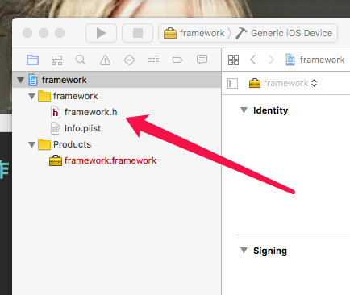

 
 
 

### 新建自己的类, 并完成代码的编写
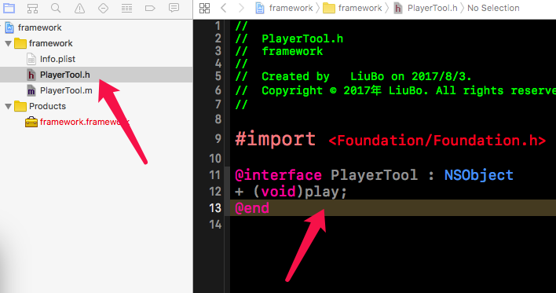
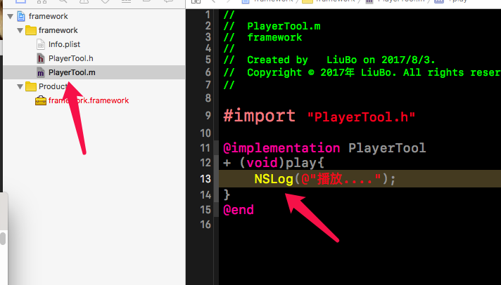
 
 
 

### 调式完工后, 再次修改配置(第二张搜索 build artive,第三张搜索 Linking)
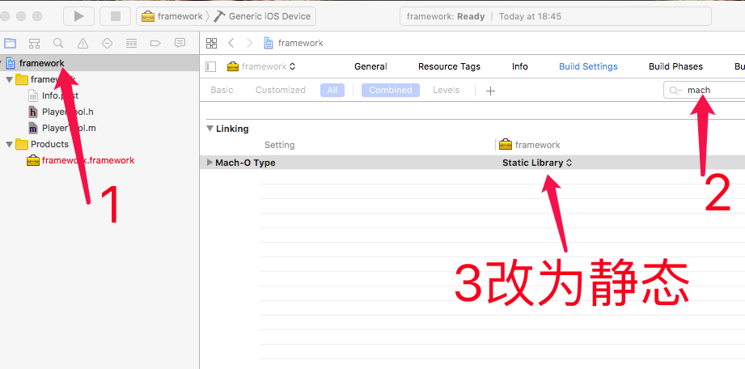
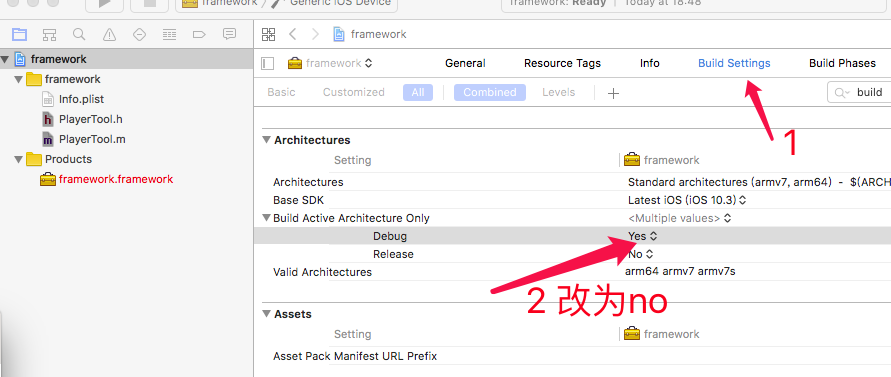
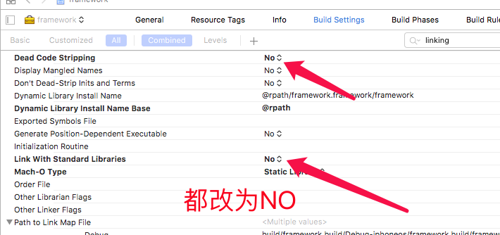
 
 
 

### 编译(debug版本,模拟器随便选择,真机可以不到mac上)
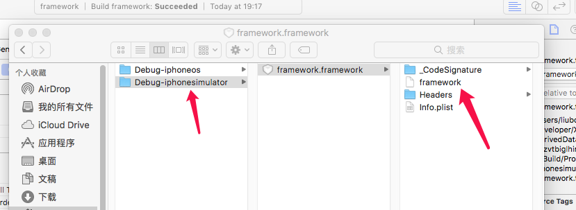
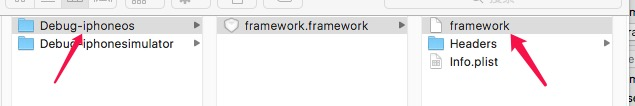
 
 
 

#### 如果不能编译出现下面的错误
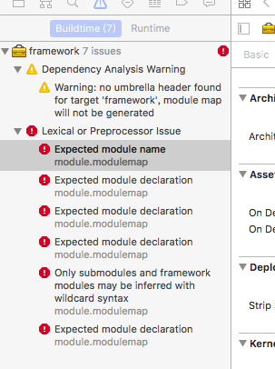
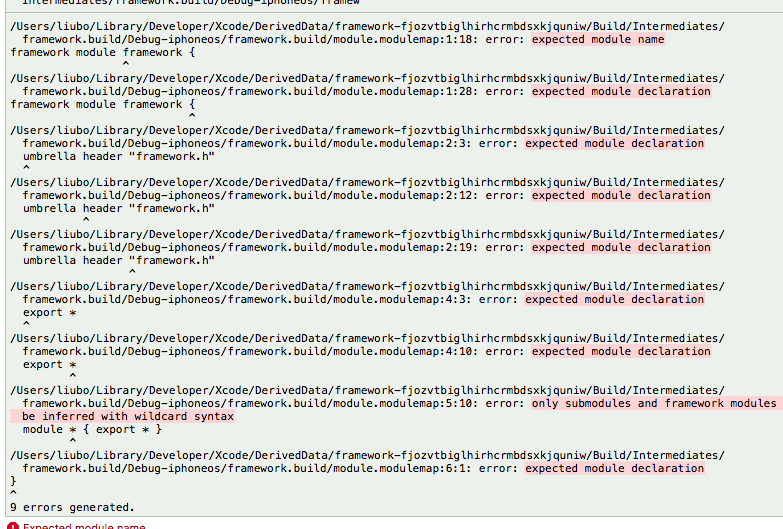
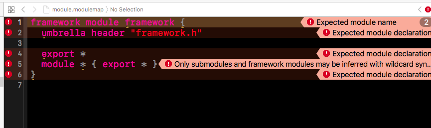
 
 
 

#### 删除掉 moudle 后再次编译
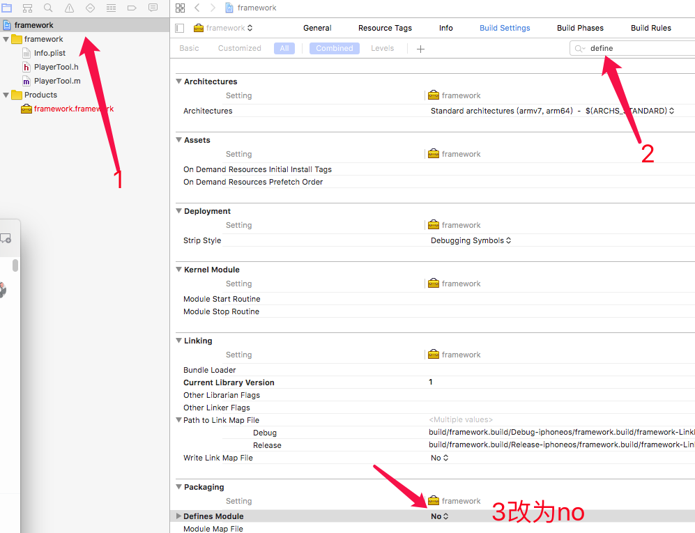
 
 
 

### 查看 真机和模拟器支持的架构(右击 frammework.framewrok show finder然后cd到真机和模拟器下生成的framework的目录里查看支持的架构)
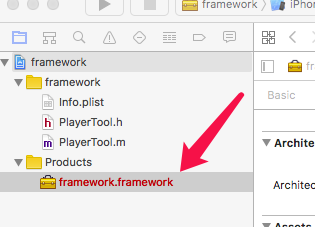
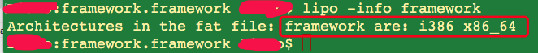
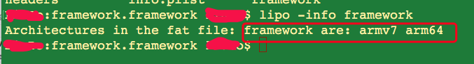
 
 
 

### 合并 
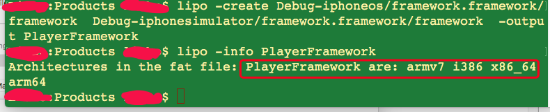
 
 
 

### 新建文件夹 将 framework 和 .h文件拖进去
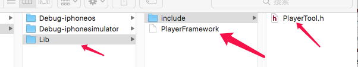
 
 
 

# realease 版本的只是这样配置后,和上面的一样
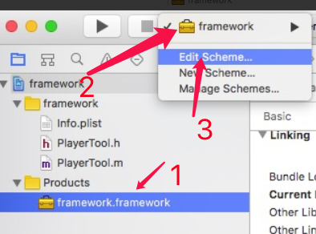
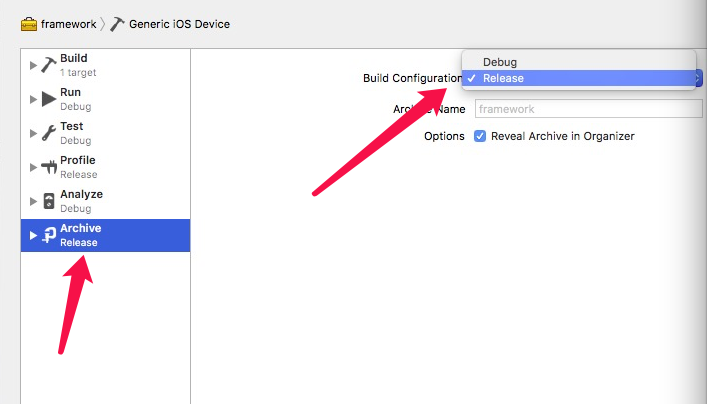
 
 
 

